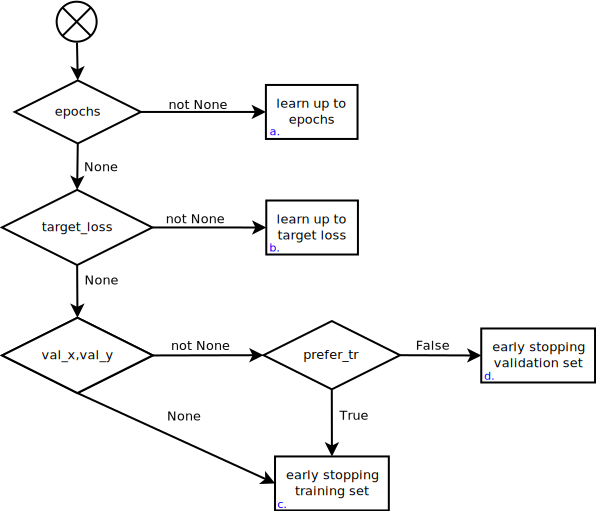
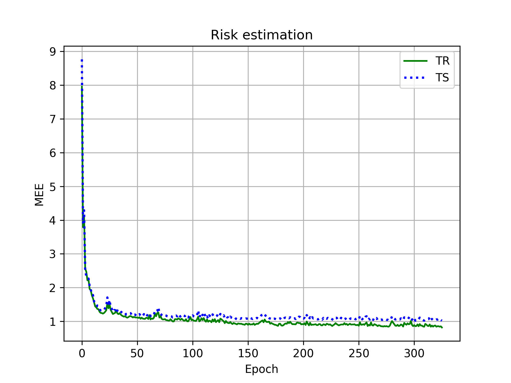

<!-- Pure latex to handle the title page -->
\title{Machine Learning Project}
\author{
  Emanuele Cosenza \\ 
  \href{mailto:e.cosenza3@studenti.unipi.it}{e.cosenza3@studenti.unipi.it} 
  \and Riccardo Massidda \\ 
  \href{mailto:r.massidda@studenti.unipi.it}{r.massidda@studenti.unipi.it}
}
\maketitle
\begin{center}
  ML course, 2019/2020. \\
  \today \\
  Type A project.
\end{center}
\begin{abstract}
Design and Python implementation of a multilayer perceptron with momentum and different regularization techniques to avoid overfitting issues.
The model selection and the assessment of the learning process on the \texttt{ML-CUP19} dataset are validated by using the cross validation method.
\end{abstract}

# Introduction
The presence of different techniques to improve the performances of an artificial neural network requires the use of formal methods to validate their effectiveness.
Implementing the network and the validation methods from the ground up has led to the execution of different experiments to motivate the design choices.

The proposed solution for the competition over the `ML-CUP19` dataset is a multilayer perceptron designed to be user configurable as much as possible, allowing a big variety of combinations to be tested independently.
The learning algorithm is based on the backpropagation algorithm[@rumelhart_parallel_1986]. Variations have been introduced in the update rule to achieve regularization or to improve the overall performances.

The network also offers the possibility of early stopping since it is a recognized regularization technique and, furthermore, it reduces the computational time by not learning for more epochs than required.

<!-- A mechanism that automatically executes a grid search over various hyperparameters combinations has been implemented to perform model selection. -->
<!-- A model assessment procedure can then be executed by using a separate test set or by the double cross validation algorithm. -->
<!-- To expect the achievement of generalization all of the experiments assume a certain degree of smoothness in the source producing the data, respecting so the inductive bias of neural networks --> 

# Method
For the implementation, Python has been chosen because of its expressiveness and the efficiency of its numerical libraries.
In particular, the implementation is based on NumPy[@oliphant_guide_2015], which has been used to efficiently manipulate data in form of vectors and matrices.
Vectorization has been exploited to speed up the learning process.

## Network
The `Network` class represents a neural network. By using its constructor it is possible to set all the required hyperparameters for the techniques that are later described.
The class offers methods to learn from a set of examples via backpropagation and to predict outcomes for new patterns in forward mode.

The initialization of the weights in each layer of the network is done by extracting values from a standard normal distribution with variance $\sigma = \frac{2}{n_i+n_o}$, where $n_i$ stands for the number of inputs in the considered layer and $n_o$ for the number of outputs.
This has been proven to be a sound choice[@glorot_understanding_nodate] in various use cases.

Different activation functions can be chosen for each layer of the neural network. The possible choices are: $tanh$, the standard logistic function, $ReLU$ and the identity function, thought to be used only in the output layer for regression tasks.

The implemented backpropagation algorithm analyzes patterns by aggregating them using the minibatch technique.
The minibatch size is a tunable hyperparameter with possible values between 1 (online training) and the size of the training set (batch training).
In the gradient descent algorithm, MSE is always used as the cost function.
To speedup the computation, the update rule also considers momentum information, achieving convergence with a smaller number of epochs.
Standard L2 regularization has also been implemented to avoid the overfitting of the training data.

The combination of some hyperparameters could lead to numerical errors due to a gradient explosion phenomenon[@pascanu2012difficulty].
This problem is dealt with by normalizing the gradient if it surpasses a certain threshold.

The learning process can be terminated with different stopping criteria, as seen in figure \ref{stop_conditions}.
The meaning of the different scenarios is the following:

a. A fixed number of epochs can be provided as an hyperparameter, leading the network to be trained for no more than the given value.
b. The training process is executed until the loss on the training set reaches a certain provided value.
c. If the loss on the training set does not improve for a fixed number of consecutive epochs, the learning process is stopped.
d. An early stopping mechanism is implemented by checking if the loss on a given validation set does not improve for a fixed number of consecutive epochs.
This solution also leads to an implicit regularization of the model, avoiding the overfitting of the dataset[@prechelt_early_nodate].

All of this techniques are bounded by a tunable maximum number of epochs, this is needed to avoid situations where there are no assurances about the effectiveness of the stopping criterion like in the case `b`.

{width=250px}

## Validation
The lack of a reliable external test set led to the development of a strategy to assess the performances of the model by using an internal one.
Because of the explicit requirement to plot the learning curve of the selected final model against both the training and the test set, double cross validation has been discarded as assessment procedure, since it produces only a scalar value representing the risk of the family of models.
Given this constraint in the validation procedure, the dataset is partitioned in development set and test set by random sampling without replacement in proportion $80/20\%$.

The development set is then used for model selection purposes through a cross validation procedure, while the test set is used to assess the selected final model.
All the validation methods hereby described are implemented in the `validation.py` script.

The model selection follows a grid search approach implemented in the class `Grid`, capable to perform the Cartesian product over the set of relevant values for each hyperparameter, returning an iterable over all the sound combinations.
The grid search is used for model selection, executing in parallel the $k$-fold cross validation algorithm for each generated assignment.

Given the results of all the cross-validation executions the model with the minimum average error on the validation sets is chosen as the winner of the process.
If early stopping was in use inside the cross-validation executions the average number of epochs reached or the average error on the training set is included to enable the final model to be retrained without a validation set.

Once completed the model selection process, by using the internal test partition extracted from the dataset, it is then possible to assess the final model and obtain the loss information needed to plot the learning curve of the model.

The mechanism hereby described is used in the script `ml-cup.py` to automatically perform model selection and assessment, in the same script, plots and results for the blind competition are produced.

# Experiments

## MONK's dataset
The results illustrated in table \ref{monks_results} are obtained by averaging eight independent runs for each task as implemented in `monks.py` script.
A single layer of four units with $tanh$ as the activation function has been used for all the experiments.
The output layer is composed by a single unit with a standard logistic activation function, the classification is obtained by rounding up to the nearest integer.
The networks have been trained for 2000 epochs by using a minibatch of 32 examples.
No further techniques are used in the experiments in figure \ref{fig:monks}, Tikhonov regularization is used for the Monks-3 regularized experiment in figure \ref{fig:monks-3_reg}.

Table: (Experimental results over the MONK's datasets) \label{monks_results}

| Task | Model | MSE (TR/TS) | Accuracy (TR/TS) (%) |
|------|-------|-------------|----------------------|
| monks-1     | $\eta = 0.5$ | 0.0005/0.0019 | 100.0%/99.91% | 
| monks-2     | $\eta = 0.5$ | 0.0003/0.0007 | 100.0%/100.0% | 
| monks-3     | $\eta = 0.5$ | 0.0091/0.0416 | 99.18%/94.50% | 
| monks-3-reg | $\eta = 0.5, \lambda = 0.01$ | 0.1160/0.1075 | 93.44%/97.22% | 

\newcommand{\monkwidth}{1.15\textwidth}
\begin{figure}
    \makebox[\textwidth][c]{
    \begin{subfigure}[b]{\monkwidth}
        \includegraphics[width=0.5\linewidth]{../results/monks_8_run/monks-1_MSE.png}
        \includegraphics[width=0.5\linewidth]{../results/monks_8_run/monks-1_MCL.png}
        \caption{Monks-1}\label{fig:monks-1}
    \end{subfigure}}
    \makebox[\textwidth][c]{
    \begin{subfigure}[b]{\monkwidth}
        \includegraphics[width=0.5\linewidth]{../results/monks_8_run/monks-2_MSE.png}
        \includegraphics[width=0.5\linewidth]{../results/monks_8_run/monks-2_MCL.png}
        \caption{Monks-2}\label{fig:monks-2}
    \end{subfigure}}
    \makebox[\textwidth][c]{
    \begin{subfigure}[b]{\monkwidth}
        \includegraphics[width=0.5\linewidth]{../results/monks_8_run/monks-3_MSE.png}
        \includegraphics[width=0.5\linewidth]{../results/monks_8_run/monks-3_MCL.png}
        \caption{Monks-3}\label{fig:monks-3}
    \end{subfigure}}
    \caption{Monks benchmark}\label{fig:monks}
\end{figure}
\begin{figure}
    \makebox[\textwidth][c]{
    \begin{subfigure}[b]{\monkwidth}
        \includegraphics[width=0.5\linewidth]{../results/monks_8_run/monks-3_reg_MSE.png}
        \includegraphics[width=0.5\linewidth]{../results/monks_8_run/monks-3_reg_MCL.png}
        \caption{Monks-3}\label{fig:monks-3}
    \end{subfigure}}
    \caption{Monks-3 with regularization}\label{fig:monks-3_reg}
\end{figure}

## Cup Results

### Screening
A set of preliminary trials, some of which have been automated by the `screening.py` script, have been executed to identify sound ranges for the hyperparameters used for the grid search in the model selection phase. 
Some of the plots that we observed and discussed in the screening phase are resumed in the appendix figure \ref{app}.

The $\alpha$ value used to tune the momentum effect is more effective when near its maximum allowed value, 1. While this can generate oscillations in the learning curve, we have observed that when using a big step size it actually smoothens an otherwise noisy curve.

Different $\eta$ values for the fixed learning rate have been observed. We noticed that there is an obvious strict correlation between the $\eta$ value and the size of the minibatch used for learning.
In order to get  e decided to fix the minibatch size and to vary $\eta$ to improve the performances of the neural network, assuming a practical standard for the minibatch size as 32.

To find reasonable bounds for the decaying learning rate, we took advice from literature [@goodfellow_deep_2016]. We have been able to confirm that good values for $\tau$, the number of iterations required before fixing the learning rate, are in the order of a few hundreds. We then found a good ratio between the initial $\eta_0$ and the final $\eta_\tau$ learning rate.

The parameter $\lambda$ used for L2 regularization has been considered effective when set to small values. Considering the fact that early stopping is used as a stopping criterion in the model selection procedure, and the fact that early stopping is itself a regularization technique, we also allowed a zero value for $\lambda$ (no L2 regularization).

Regarding the early stopping, we have found an interesting trade-off spot for the patience parameter in a few hundreds of epochs. This choice was derived from the observation of the relationship between patience and number of epochs and the relationship between patience and error on the experiment validation set.
In particular, we noticed that the number of epochs quickly grows linearly with the patience, while the error on the VL decreases more than linearly with respect to the patience.

In order to obtain a grid of reasonable size, we narrowed the search for the hidden activation function to $tanh$ and ReLU. We chose to discard the standard logistic function, as it seemed to always converge slower than $tanh$ and ReLU.
Since the \texttt{ML-CUP19} dataset offers a regression task, the identity function was considered as the only activation function in the output layer.
Given the relative simplicity of the task at hand, we chose to consider only networks composed by one or two layers. To establish reasonable values for the number of units, we experimented with networks having a progressively higher number of units. In accordance to ML theory, we found the more complex networks to be more flexible than the simpler ones. At the end of this phase, we finally considered three different topologies: [20, 32, 2], [20, 64, 2] and [20, 32, 32, 2].

These considerations lead to the final grid chosen for the model selection that we report in table \ref{grid_ranges}.
The grid describes 108 possible combinations of hyperparameters, of which 72 with fixed learning rate and 36 with decaying learning rate.

Table: (Range of hyperparameters used in the grid search) \label{grid_ranges}

| | Hyperparameter | Values |
|--|--|--|
|  | `topology` | [20,32,2], [20,64,2], [20,32,32,2] |
| $f$  | `f_hidden` | tanh, ReLU |
| $\eta$ | `eta` | $5*10^{-2}$, $1*10^{-2}$ |
| $\lambda$ | `weight_decay` | $1*10^{-4}$, $5*10^{-5}$, 0 |
| $\alpha$ | `momentum` | 0.99, 0.999 |
|  | `minibatch` | 32 |
|  | `patience` | 100 |
| $\tau$ | `tau` | 200 |
| $\eta_0$ | `eta_zero` | 0.1 |
| $\eta_\tau$ | `eta` | 0.01 |

### Final model: selection, assessment and discussion

After the screening phase and the grid building procedure, we proceeded to select a model and assess it through a final experiment. As any other experiment we did, this was executed on a machine with an 8 core CPU (Intel i7-8565U (8) @ 4.600GHz) and 8 Gb of RAM, granting a maximum parallelism degree of 8 in the cross validation.

Following the formal procedure described in the validation section, a model has been chosen by means of a grid search using a 10-fold cross validation schema. The entire model selection took 4 hours and 40 minutes to finish. The average training time for a single model was 2 minutes.
We report the grid search results for the three best models in Table \ref{grid_results}.

Table: (Results for the grid search. Only the first three models are reported, each with its hyperparameters, training MEE and validation MEE. Training MEE and validation MEE are computed as averages on the 10 folds.) \label{grid_results}

| | `topology` | $f$ | $\eta$ | $\alpha$ | $\lambda$ | TR MEE | VL MEE |
|--|--|--|--|--|--|--|--|
| Winner | [20, 32, 32, 2] | $tanh$ | $5*10^{-2}$ | 0.99 | $1*10^{-4}$ | 0.834 | 1.008 |
| 2nd | [20, 32, 32, 2] | $tanh$ | $5*10^{-2}$ | 0.99 | $5*10^{-5}$ | 0.836 | 1.013 |
| 3rd | [20, 32, 32, 2] | $tanh$ | $1*10^{-2}$ | 0.99 | $5*10^{-5}$ | 0.924 | 1.024 |

The topology [20, 32, 32, 2] was by far the most successful (the best network with a different topology finished in 13th position). Similarly, $tanh$ was by far the best hidden activation function (the best ReLU network placed 11th). Also, $\alpha=0.99$ happened to be a good value for the momentum parameter, while the $\eta$ parameter did not seem to be too decisive with respect to generalization capacity.

Given the selected final model, we retrained it on the development set (80% of the data) and we then assessed it on the previously extracted internal test set (20% of the data). The plot relative to the final retraining, which contains TR and TS learning curves, is reported in Figure \ref{fig:risk_estimation}.

{width=350px}

The plot shows again that the selected model converges well on the training set, proving that the back-propagation algorithm has been implemented correctly. Also, the validation error goes down together with the training error, showing that the network is able to generalize on unseen data.

The final trained model has been used to compute the final outputs for the blind test set. To check if the blind test set outputs were reasonable, we represented them as points in a 2D plot together with the training set outputs (\ref{app}). We found that the outputs of our final model lied near the curve identified by the training outputs, showing that the model approximated well the unknown function.

# Conclusions
In this report we presented a NumPy implementation of a basic multilayer perceptron equipped with momentum, L2 regularization and various configurable stopping criteria, including early stopping. We reported the main design choices, describing the network structure and the main techniques involved in it.

We then described the general procedures used to validate the network: for model selection we implemented a grid search procedure over a $k$-fold cross validation, while for model assessment we used a simple hold out division (80%/20%).

We proved the proper functioning of the learning algorithm on the MONKS dataset, showing that the network can learn and generalize well in a classification task.

Next, we focused on the proposed \texttt{ML-CUP19} competition. In the screening phase, we analysed the model behaviour under different circumstances on the regression dataset, doing various experiments to find good ranges for the tunable hyperparameters. At the end of this phase, we constructed a grid of hyperparameters, we built the best model out of it and we assessed the final model on an internal test set, giving an estimate of the performance of the network on the blind test set.

# References

\newpage
# Appendix
