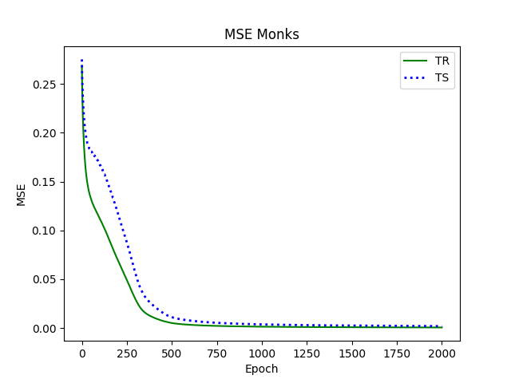
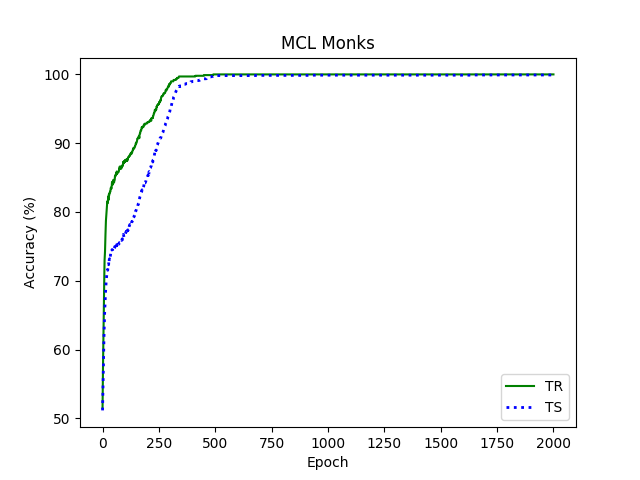
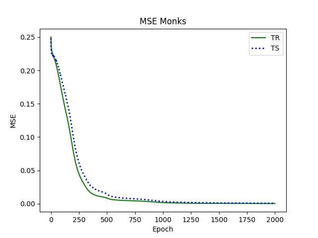
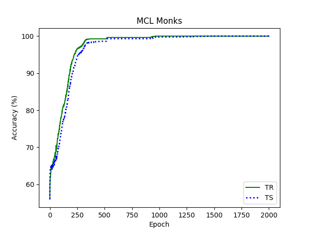
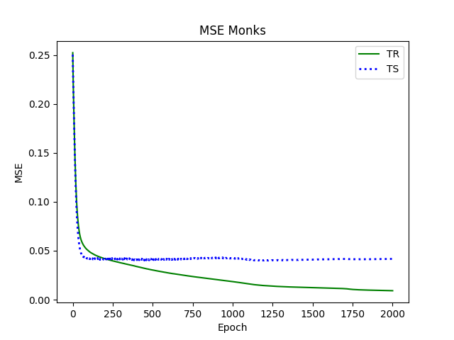
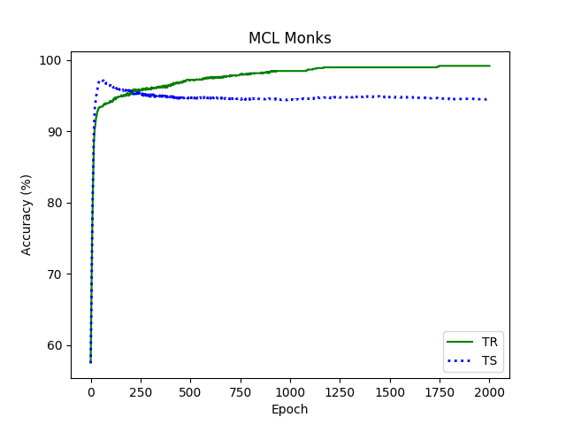
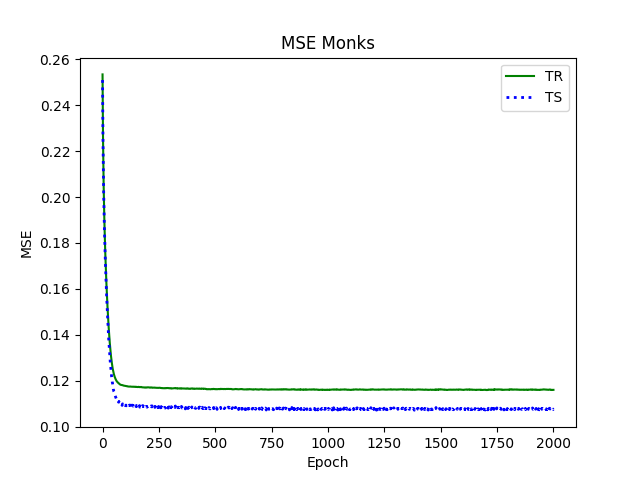
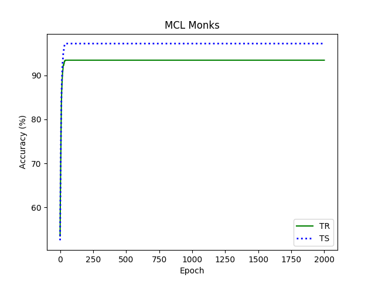

<!-- Pure latex to handle the title page -->
\title{An Astonishing Title}
\author{
  Emanuele Cosenza \\ 
  \href{mailto:e.cosenza3@studenti.unipi.it}{e.cosenza3@studenti.unipi.it} 
  \and Riccardo Massidda \\ 
  \href{mailto:r.massidda@studenti.unipi.it}{r.massidda@studenti.unipi.it}
}
\maketitle
\begin{center}
  ML course, 2019/2020. \\
  \today \\
  Type A project.
\end{center}
\begin{abstract}
Design and Python implementation of a multilayer perceptron with momentum and different regularization techniques to avoid overfitting issues.
The model selection and the assessment of the learning process on the \texttt{ML-CUP19} dataset are validated by using the cross validation method.
\end{abstract}

# Introduction
The presence of different techniques to improve the performances of an artificial neural network requires the use of formal methods to validate their effectiveness.
Implementing the network and the validation methods from the ground up has led to the execution of different experiments to motivate the design choices.

The proposed solution for the competition over the `ML-CUP19` dataset is a multilayer perceptron designed to be user configurable as much as possible, allowing a big variety of combinations to be tested independently.
The learning algorithm is based on the backpropagation algorithm[@rumelhart_parallel_1986]. Variations have been introduced in the update rule to achieve regularization or to improve the overall performances.

The network also offers the possibility of using early stopping as a stopping criterion, since it is a recognized regularization technique and, furthermore, it reduces the computational time by not learning for more epochs than required.

A mechanism that automatically executes a grid search over various hyperparameters combinations has been implemented to perform model selection.
A model assessment procedure can then be executed by using a separate test set or by the double cross validation algorithm.

<!-- To expect the achievement of generalization all of the experiments assume a certain degree of smoothness in the source producing the data, respecting so the inductive bias of neural networks --> 

# Method
For the implementation, Python has been chosen because of its simplicity and the efficiency of its numerical libraries. In particular, the implementation is based on NumPy[@oliphant_guide_2015], which has been used to efficiently manipulate data in form of vectors and matrices. To speed up the learning process, vectorization has been exploited in operations involving vectors and matrices.

## Network
The `Network` class represents a neural network. By using its constructor it is possible to set all the required hyperparameters for the techniques that are described later.
The class offers methods to learn from a set of examples via backpropagation and to predict sound outcomes for new patterns in forward mode.

The initialization of the weights in each layer of the neural network is done by extracting values from a standard normal distribution with variance $\sigma = \frac{2}{n_i+n_o}$, where $n_i$ stands for the number of inputs in the considered layer and $n_o$ for the number of outputs.
This has been proven to be a sound choice[@glorot_understanding_nodate] in various use cases.

Different activation functions can be chosen for each layer of the neural network. The possible choices are: $tanh$, the standard logistic function, $ReLU$ and the identity function (used only in the output layer for regression tasks).

The implemented backpropagation algorithm analyzes patterns by aggregating them using the minibatch technique. The batch size is a tunable hyperparameter with possible values between 1 (online training) and the size of the training set (batch training).
In the gradient descent algorithm, MSE is always used as the cost function.
To speedup the computation, the update rule also considers momentum information, achieving convergence with a smaller number of epochs.
Standard L2 regularization has also been implemented to avoid the overfitting of the training data.

The combination of some hyperparameters could lead to numerical errors due to a gradient explosion phenomenon.[@pascanu2012difficulty].
This problem is dealt with by normalizing the gradient if it surpasses a certain threshold.

The learning process can be terminated with three different stopping criteria:

- A fixed number of epochs can be provided as an hyperparameter, leading the network to be trained for no more than the provided value.
- An early stopping mechanism is implemented by checking if the loss on a given validation set does not improve for a fixed number of consecutive epochs.
This solution also leads to an implicit regularization of the model, avoiding the overfitting of the dataset[@prechelt_early_nodate].
- Given a threshold value $t$, if the loss on the training set does not improve by at least $t$ for a fixed number of consecutive epochs, the learning process is stopped.
This is equivalent to assert that the norm of the gradient in the SGD algorithm is stuck under a certain threshold.

## Validation: model selection and model assessment

The lack of a reliable external test set led to the development of a strategy to assess the performances of the model by using an internal one.
Because of the explicit requirement to plot the learning curve of the selected final model against both the training and the test set, double cross validation has been avoided, since it produces only a scalar value representing the risk of the family of models.
Given this constraint in the validation procedure, the dataset is partitioned in development set and test set by random sampling without replacement in proportion $80/20\%$. The development set is then used for model selection purposes through a cross validation procedure, while the test set is used to assess the selected final model.

The model selection follows a grid search approach, implemented in `grid.py` as a function capable to perform the Cartesian product over the set of relevant values for each hyperparameter, returning an iterable over all the sound combinations.
The grid search is used for model selection, executing the $k$-fold cross validation algorithm implemented in `validation.py` for each possible combination.
The implementation shuffles the data, uses by default $k=5$ folds over the development set, dividing it in training set and validation set, and finally returns the best hyperparameter selection.
Given the final choice of hyperparameters, a new model is trained again by using the whole development set.

By using the internal test partition extracted from the dataset, it is then possible to assess the final model and obtain the loss information needed to plot the learning curve of the model.

The mechanism hereby described is used in the script `ml-cup.py` to automatically perform model selection and assessment. In the same script, plots and results for the blind competition are produced.

# Experiments

## MONK's dataset

The results illustrated in table \ref{monks_results} and \ref{monks_plots} are obtained by averaging eight independent runs for each task.
In all the experiments, the employed neural networks are composed by a single hidden layer containing 4 hidden units. Since all three tasks are based on binary classification, the output layer is composed by a single unit with a standard logistic function as the activation function. The network outputs are therefore in the range $(0, 1)$. To get the actual classification prediction, each output is then rounded up to the nearest integer (0 or 1).  In the hidden layer, $tanh$ is used as the activation function.
The networks have been trained for 2000 epochs by using a minibatch of 32 examples. No further techniques are used unless otherwise noted in the tables.

Table: (Experimental results over the MONK's datasets) \label{monks_results}

| Task | Model | MSE (TR/TS) | Accuracy (TR/TS) (%) |
|------|-------|-------------|----------------------|
| monks-1     | $\eta = 0.5$ | 0.0005/0.0019 | 100.0%/99.91% | 
| monks-2     | $\eta = 0.5$ | 0.0003/0.0007 | 100.0%/100.0% | 
| monks-3     | $\eta = 0.5$ | 0.0091/0.0416 | 99.18%/94.50% | 
| monks-3-reg | $\eta = 0.5, \lambda = 0.01$ | 0.1160/0.1075 | 93.44%/97.22% | 

Table: (Plot of MSE and accuracy for the MONK’s benchmark) \label{monks_plots}

|  MSE (TR/TS) |  Accuracy (TR/TS) (%) |
|--------------|------------------------|
| { width=230px } | { width=230px } |
| { width=230px } | { width=230px } |
| { width=230px } | { width=230px } |
| { width=230px } | { width=230px } |

## Cup Results

# Conclusions

# References
